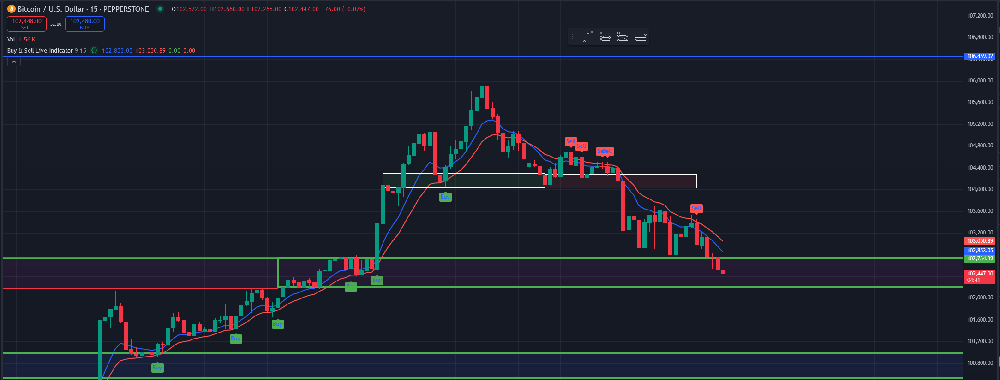

# Buy & Sell Live Indicator in Pine Script

## Introduction

Trading indicators help traders make informed decisions by analyzing market trends. The **Buy & Sell Live Indicator** is a simple yet effective Pine Script indicator that generates buy and sell signals based on Exponential Moving Averages (EMA). This indicator is particularly useful for traders who rely on trend-based strategies.

## How It Works

The indicator utilizes two EMAs:
- **Fast EMA (user-decided-period)** - Short-term trend indicator.
- **Slow EMA (user-decided-period)** - Longer-term trend indicator.

## Example Chart

Below is an example of how the **Buy & Sell Live Indicator** looks when applied to a trading chart:

## Conclusion

This **Buy & Sell Live Indicator** helps traders identify entry and exit points by leveraging EMA crossovers and price action confirmations. It is a great addition to a trader’s toolkit for identifying market trends effectively.

For best results, combine this indicator with other confirmation tools like volume analysis or support & resistance levels.

---
_**Disclaimer:** This indicator should not be used as financial advice. Always backtest and use risk management strategies when trading._

